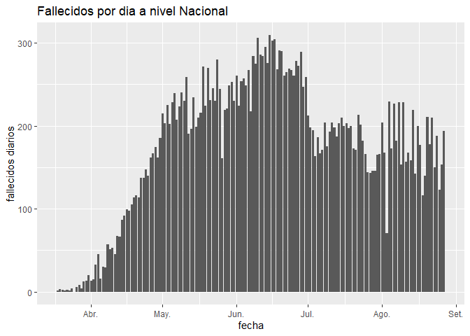
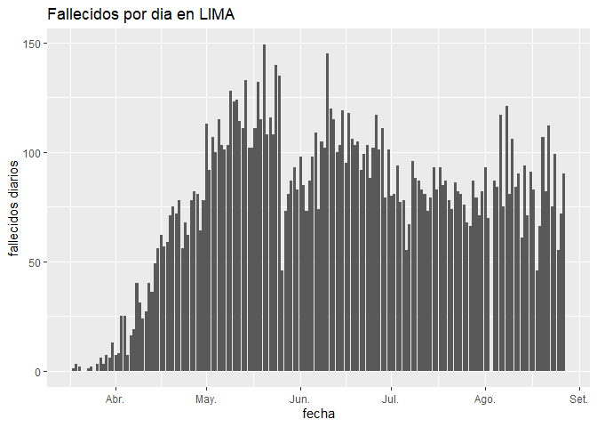
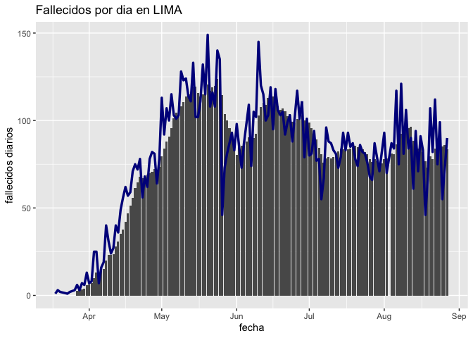
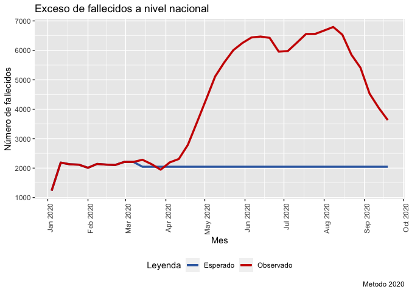
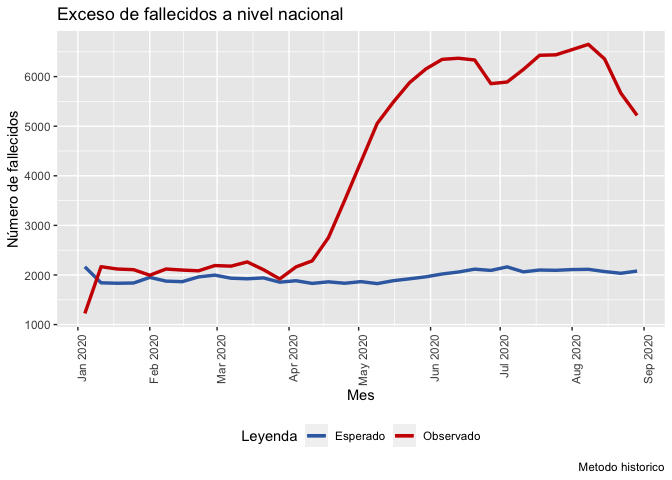
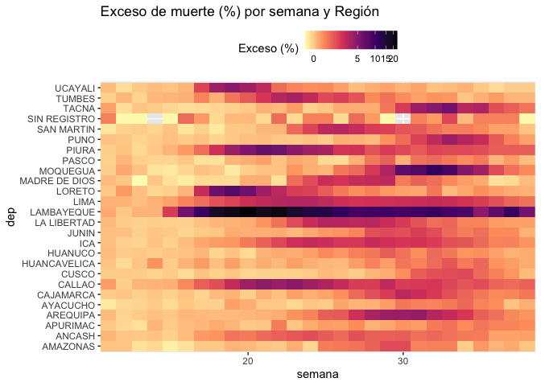
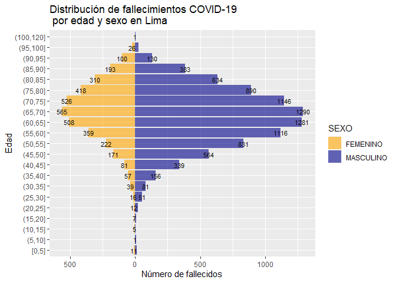
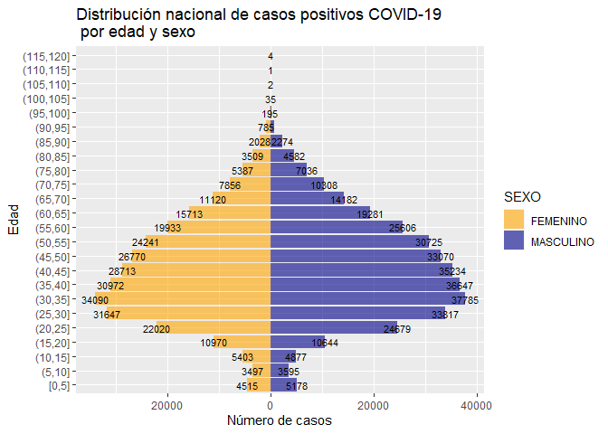
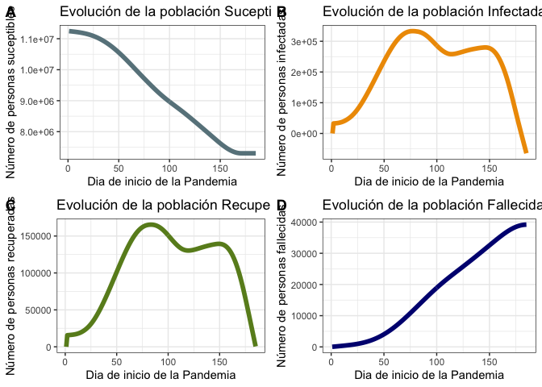
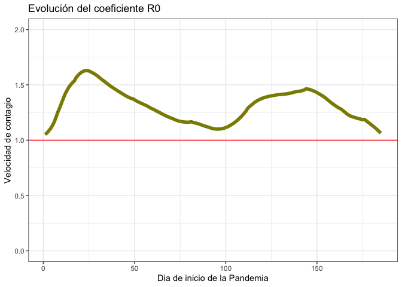

<!-- README.md is generated from README.Rmd. Please edit that file -->

# covidPeru

<!-- badges: start -->

<!-- badges: end -->

El objetivo de este paquete es facilitar el uso de la información que
tenemos disponible en el portal de datos abiertos del gobierno sobre
COVID.

Empezó como algo de uso personal que espero sirva para tomadores de
decisiones, periodistas, o cualquier persona que quiera trabajar con
datos sobre COVID.

## Installation

Puedes instalar el paquete siguiendo estos pasos:

``` r
install.packages("devtools")
devtools::install_github("jincio/covidPeru")
```

## Ejemplo

Primero tenemos que llamar los data frames y luego podemos proceder con
la limpieza y generar unos gráficos.

``` r
library(dplyr) ## Necesario!
library(readr) ## Necesario!
library(ggplot2) ## Necesario!
library(lubridate)## Necesario!
library(purrr) ## Necesario
library(MMWRweek) ## Necesario
library(covidPeru) 
```

``` r
library(covidPeru)
```

    #> Loading covidPeru

Cargamos el último set disponible en el portal de datos abiertos de
pruebas analizadas con resultado positivo.

``` r
positivos=da_positivos() # Crea un dataframe con la información positivos
```

``` r
head(positivos)
#> # A tibble: 6 x 14
#>   UUID  DEPARTAMENTO PROVINCIA DISTRITO METODODX  EDAD SEXO  FECHA_RESULTADO
#>   <chr> <chr>        <chr>     <chr>    <chr>    <dbl> <chr>           <dbl>
#> 1 7320… LIMA         LIMA      SAN BOR… PCR         34 FEME…        20200325
#> 2 e816… LIMA         LIMA      SAN BOR… PCR         30 FEME…        20200406
#> 3 71ec… LIMA         LIMA      SAN BOR… PCR         34 FEME…        20200410
#> 4 566a… LIMA         LIMA      BREÑA    PCR         32 FEME…        20200403
#> 5 0275… LIMA         LIMA      LIMA     PCR         31 FEME…        20200409
#> 6 f016… LIMA         LIMA      LIMA     PCR         30 FEME…        20200409
#> # … with 6 more variables: year <chr>, month <chr>, day <chr>, fecha <date>,
#> #   EDAD_n <dbl>, semana <dbl>
```

Cargamos el último set disponible en el portal de datos abiertos de
fallecidos por COVID-19.

``` r
fallecidos=da_fallecidos() # Crea un dataframe con la información de fallecidos.
```

``` r
head(fallecidos)
#> # A tibble: 6 x 13
#>   UUID  FECHA_FALLECIMI… EDAD_DECLARADA SEXO  FECHA_NAC DEPARTAMENTO PROVINCIA
#>   <chr>            <dbl>          <dbl> <chr>     <dbl> <chr>        <chr>    
#> 1 6b9e…         20200701             63 MASC…  19561228 LIMA         LIMA     
#> 2 beca…         20200701             63 MASC…  19570629 LIMA         LIMA     
#> 3 e5c2…         20200701             67 MASC…  19530524 LA LIBERTAD  ASCOPE   
#> 4 e844…         20200701             59 MASC…  19610210 LA LIBERTAD  TRUJILLO 
#> 5 dfe8…         20200701             61 FEME…  19581113 LA LIBERTAD  TRUJILLO 
#> 6 d780…         20200701             54 FEME…  19650921 LA LIBERTAD  VIRU     
#> # … with 6 more variables: DISTRITO <chr>, year <chr>, month <chr>, day <chr>,
#> #   fecha <date>, semana <dbl>
```

Cargamos el último set de SINADEF disponible en el portal de datos
abiertos. Este demora un poco más, tengan paciencia\!.

``` r
sinadef=da_sinadef()
```

``` r
head(sinadef)
#> # A tibble: 6 x 6
#>   fecha      semana  year dia       `DEPARTAMENTO DOMICILI… `PROVINCIA DOMICILI…
#>   <date>      <dbl> <dbl> <chr>     <chr>                   <chr>               
#> 1 2020-01-22      4  2020 Wednesday LIMA                    LIMA                
#> 2 2020-01-24      4  2020 Friday    CUSCO                   CUSCO               
#> 3 2020-01-30      5  2020 Thursday  CALLAO                  CALLAO              
#> 4 2020-01-19      4  2020 Sunday    CAJAMARCA               CAJAMARCA           
#> 5 2020-01-13      3  2020 Monday    LA LIBERTAD             TRUJILLO            
#> 6 2020-01-25      4  2020 Saturday  CAJAMARCA               CAJAMARCA
```

Una vez con las bases podemos usar las otras funciones para generar
series diarias y algunos gráficos de estas series.

Las funcion entrega una lista con dos objetos: una data y un gráfico.

``` r
fdiarios=fallecidos_diarios(fallecidos)[[1]]
head(fdiarios)
#> # A tibble: 6 x 2
#>   fecha      count
#>   <date>     <int>
#> 1 2020-03-18     1
#> 2 2020-03-19     3
#> 3 2020-03-20     2
#> 4 2020-03-21     1
#> 5 2020-03-22     2
#> 6 2020-03-23     1
```

``` r
grafico=fallecidos_diarios(fallecidos)[[2]]
print(grafico)
```



Podemos identificar un departamento en específico.

``` r
fdiarios=fallecidos_diarios(fallecidos, "lima")[[1]]
head(fdiarios)
#> # A tibble: 6 x 3
#> # Groups:   DEPARTAMENTO [1]
#>   DEPARTAMENTO fecha      count
#>   <chr>        <date>     <int>
#> 1 LIMA         2020-03-18     1
#> 2 LIMA         2020-03-19     3
#> 3 LIMA         2020-03-20     2
#> 4 LIMA         2020-03-23     1
#> 5 LIMA         2020-03-24     2
#> 6 LIMA         2020-03-26     3
```

``` r
grafico=fallecidos_diarios(fallecidos, "lima")[[2]]
print(grafico)
```



  - Podemos agregar una media móvil también.

<!-- end list -->

``` r
grafico=fallecidos_diarios(fallecidos, "lima",mediamovil = 7)[[2]]
print(grafico)
#> Warning: Removed 6 rows containing missing values (position_stack).
```



### Exceso de muertos

En el paquete también está disponible la función para calcular el exceso
de muertos en Perú y por departamentos por semana.

En este caso la información se calcula por semana. Hay dos “métodos”
disponibles. El método por default toma como referencia las primeras 11
semanas del 2020 (“M2020”), y el “alternativo” que usa el promedio de
muertos de los años 2017,2018, 2019 con la semana de comparación.

``` r
base=exceso_muertes(sinadef)[1]
#> [1] "Ojo: archivo actualizado al 2020-09-23 tomamos referencia hasta la semana 38"
head(base,30)
#> [[1]]
#> # A tibble: 38 x 6
#>    semana  year numero_fallecidos Esperado Exceso fecha_ultima
#>     <dbl> <dbl>             <int>    <dbl>  <dbl> <date>      
#>  1      1  2020              1233     1233      0 2020-01-04  
#>  2      2  2020              2187     2187      0 2020-01-11  
#>  3      3  2020              2130     2130      0 2020-01-18  
#>  4      4  2020              2117     2117      0 2020-01-25  
#>  5      5  2020              2011     2011      0 2020-02-01  
#>  6      6  2020              2142     2142      0 2020-02-08  
#>  7      7  2020              2119     2119      0 2020-02-15  
#>  8      8  2020              2107     2107      0 2020-02-22  
#>  9      9  2020              2211     2211      0 2020-02-29  
#> 10     10  2020              2210     2210      0 2020-03-07  
#> # … with 28 more rows
```

``` r
grafico=exceso_muertes(sinadef)[2]
#> [1] "Ojo: archivo actualizado al 2020-09-23 tomamos referencia hasta la semana 38"
print(grafico)
#> [[1]]
```



``` r
grafico=exceso_muertes(sinadef,metodo = FALSE)[2]
#> [1] "Ojo: archivo actualizado al 2020-09-23 tomamos referencia hasta la semana 38"
print(grafico)
#> [[1]]
```



**Lima**

``` r
Lima=exceso_muertes(sinadef,"Lima")[2]
#> [1] "Ojo: archivo actualizado al 2020-09-23 tomamos referencia hasta la semana 38"
print(Lima)
#> [[1]]
```


\*\* Gabriel Carrasco-Escobar (Gabc91) preparó una función que hemos
agregado al paquete. La función te da como resultado un gráfico a modo
de panel de calor con el exceso de muertes para todas las regiones \*\*

``` r
grafico=panel_exceso(sinadef)
```

``` r
print(grafico)
```



\*\* Juan Gamboa Unsihuay (jesuseduardog) preparó una función que hemos
agregado al paquete. La función te da como resultado una base y un
gráfico que describen la población contagiada y la población fallecida
por sexo y edad. El gráfico tiene una forma piramidal y su eficacia
reside en que permite caracterizar la distribución por edad y sexo de un
colectivo determinado, en este caso el grupo de casos covid positivos y
el grupo de fallecidos covid. Esto a nivel nacional como a nivel
departamental.

**Lima**

``` r
base = piramide_fcovid(fallecidos,"Lima")[[1]]
head(base)
#> # A tibble: 6 x 3
#> # Groups:   SEXO, EDAD_CAT [6]
#>   SEXO     EDAD_CAT     n
#>   <chr>    <fct>    <int>
#> 1 FEMENINO [0,5]       11
#> 2 FEMENINO (5,10]       1
#> 3 FEMENINO (10,15]      5
#> 4 FEMENINO (15,20]      7
#> 5 FEMENINO (20,25]     12
#> 6 FEMENINO (25,30]     16
```

``` r
grafico = piramide_fcovid(fallecidos,"Lima")[[2]]
print(grafico)
```



**Nacional**

``` r
base <- piramide_pcovid(positivos)[[1]]
head(base)
#> # A tibble: 6 x 3
#> # Groups:   SEXO, EDAD_CAT [6]
#>   SEXO     EDAD_CAT     n
#>   <chr>    <fct>    <int>
#> 1 FEMENINO [0,5]     4515
#> 2 FEMENINO (5,10]    3497
#> 3 FEMENINO (10,15]   5403
#> 4 FEMENINO (15,20]  10970
#> 5 FEMENINO (20,25]  22020
#> 6 FEMENINO (25,30]  31647
```

``` r
grafico = piramide_pcovid(positivos)[[2]]
print(grafico)
```



\*\* Cesar Urquizo (CUrquizoU) preparo una función que hemos agregado al
paquete. Esta funcion replica el modelo del documento de investigación
*Estimating and simulating a SIRD Model of COVID-19 for many countries,
states, and cities* de Jesus Fernandez Villaverde y Charles Jones
(2020).

El modelo permite reconstruir a partir de la base de fallecidos del
SINADEF, los casos de fallecidos, casos positivos, población vulnerable
y población recuperada. Asimismo, se calcula la velocidad de contagio
del virus o también denominado R0. Lo importante de este modelo es que
permite conocer la dinamica de las principales variables como la
evolución de los casos de fallecidos, contagiados o recuperados.

**Resultados de la estimación**

``` r
resultados <- sird_villaverde(sinadef,"Lima")
```

**Población suceptible**

``` r
S <- resultados[["S"]]
head(S)
#> [1] 11245182 11241647 11238049 11234361 11230574 11226654
```

**R0**

``` r
r0 <- resultados[["R0"]]
head(r0)
#> [1] 1.051583 1.065327 1.085292 1.105263 1.132675 1.165557
```

Adicional, el paquete contiene la función sird\_graficos que permite
realizar una inspección gráfica de los resultados obtenidos del modelo
Villaverde.

**Principales variables SIRD**

``` r
graficos <- sird_graficos(resultados)
```

**R0**

``` r
print(graficos[[1]])
```



``` r
print(graficos[[2]])
```


